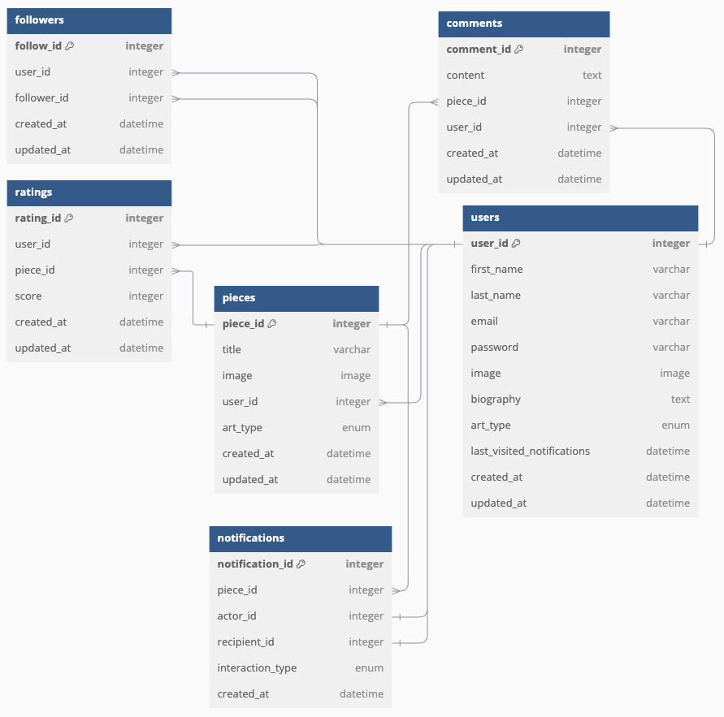

# Stitch Space: a fibre art portfolio social site 
This repository contains the back-end API for the Stitch Space website. The front-end repository can be found [here](https://github.com/EvitaKnits/stitch-space). The back-end API is built using Django, Django REST Framework, Python, and PostgreSQL, and is hosted on Heroku.

This README focuses exclusively on the back-end components and functionality within this repository. For information on the front end, including competitor analysis, development management with GitHub Projects, and Agile methodology, please refer to the README in the front-end repository.

To visit the deployed Stitch Space site [click here](https://stitch-space-f65c363b25bd.herokuapp.com/)

# Table of Contents
1. [Purpose](#1-purpose)
2. [Database Schema](#2-database-schema) 
    - [Data Validation](#data-validation)
    - [Image Storage](#image-storage)
    - [Development Notes](#development-notes)
3. [Endpoints and HTTP Requests](#3-endpoints-and-http-requests)
    - [Resource: users](#resource-users)
    - [Resource: pieces](#resource-pieces)
    - [Resource: comments](#resource-comments)
    - [Resource: ratings](#resource-ratings)
    - [Resource: followers](#resource-followers)
4. [Testing](#5-testing)
    - [Continuous Testing](#continuous-testing) 
    - [Automated Testing](#automated-testing)
    - [Manual Testing](#manual-testing)
    - [Code Validation](#code-validation)
5. [Bugs](#6-bugs)
6. [Deployment](#7-deployment)
7. [Credits](#8-credits)

## 1. Purpose
The goal of this API is to provide the required data to the front-end application to power Stitch Space: the dedicated space for fibre artists to showcase their portfolios.

## 2. Database Schema

I constructed this Entity Relationship Diagram prior to starting my project, to ensure the key entities and relationships were defined in Stitch Space.



Not shown in the diagram is that I will set two unique constraints to ensure: 

- A user can only follow another user once
- A user can only rate a piece once

**Development Notes**
During the development process, I found that 'username' is a required field when extending Django's AbstractUser model. I didn't want to use the AbstractBaseUser so decided to implement a username after all. 

### Data validation 

Data validation rules ensure the accuracy and reliability of information stored in the system, ensuring all entries adhere to expected formats. Below, I have detailed the requirements either defined in my models, required by my forms or as they stand in the Abstract User model inherited from Django:

**users**

- user_id: must be a unique integer (auto-assigned by Django)
- first_name: must be a non-empty string (max-length 150 characters)
- last_name: must be a non-empty string (max-length 150 characters)
- email: must be a valid email format and unique within the system
- password: Must meet validity requirements set out by Django's built-in password validators, quoted below [from the source](https://docs.djangoproject.com/en/5.0/topics/auth/passwords/#using-built-in-validators).
    - UserAttributeSimilarityValidator, which checks the similarity between the password and a set of attributes of the user.
    - MinimumLengthValidator, which checks whether the password meets a minimum length. This validator is configured with a custom option: it now requires the minimum length to be nine characters, instead of the default eight.
    - CommonPasswordValidator, which checks whether the password occurs in a list of common passwords. By default, it compares to an included list of 20,000 common passwords.
    - NumericPasswordValidator, which checks whether the password isn’t entirely numeric.
- image: must be a maximum size of 10MB
- biography: an optional text field
- art_type: must be one of the predefined types (knitting, crochet, embroidery, weaving, dyeing, other)
- last_visited_notifications: Datetime that may be empty (until first value is added)§
- created_at: Datetime assigned on creation of user instance
- updated_at: Datetime that may be empty (until first update is carried out)

**pieces**

- piece_id: must be a unique integer (auto-assigned by Django)
- title: must be a non-empty string (max-length 150 characters)
- image: must be a maximum size of 10MB
- user_id: must be an existing user_id
- art_type: must be one of the predefined types (knitting, crochet, embroidery, weaving, dyeing, other)
- created_at: Datetime assigned on creation of piece instance
- updated_at: Datetime that may be empty (until first update is carried out)

**comments**

- comment_id: must be a unique integer (auto-assigned by Django)
- content: a mandatory text field
- piece_id: must be an existing piece_id
- user_id: must be an existing user_id
- created_at: Datetime assigned on creation of comment instance
- updated_at: Datetime that may be empty (until first update is carried out)

**ratings**

- rating_id: must be a unique integer (auto-assigned by Django)
- user_id: must be an existing user_id
- piece_id: must be an existing piece_id
- score: must be an integer between 1 and 5
- created_at: Datetime assigned on creation of rating instance
- updated_at: Datetime that may be empty (until first update is carried out)

**followers**

- follower_id: must be a unique integer (auto-assigned by Django)
- user_id: must be an existing user_id
- follower_id: must be an existing follower_id
- created_at: Datetime assigned on creation of follower instance
- updated_at: Datetime that may be empty (until first update is carried out)

**notifications**

- notification_id: must be a unique integer (auto-assigned by Django)
- piece_id: optional - used only for comments and ratings
- actor_id: must be an existing user_id
- recipient_id: must be an existing user_id
- interaction_type: must be one of the predefined types (comment, rating, follow)
- created_at: Datetime assigned on creation of notification instance

### Image Storage
Cloudinary is used to store and manage user-uploaded images, such as profile pictures and artwork. The service handles secure uploads and ensures efficient storage and delivery of images. Cloudinary also provides automatic optimisation, ensuring that images are served in the appropriate size and format for different devices, improving overall performance.

Images are uploaded via the API, and the corresponding URLs are stored in the database for later retrieval. This allows the application to manage images without directly handling large files on the server.

### Development Notes
During implementation, I made some tweaks to my planned models to ensure maximum code readability and to follow convention I'd not previously known, where relevant. 
- It is not best practice to use '_id' suffixes on foreign keys, so these were removed.
- It is clearer to call the user that has been followed 'followed_user' rather than just 'user' so I changed this in the Followers table.
- I removed the 'updated_at' field from followers and comments as it was not relevant to them. A follower either is present or is deleted. A comment will not be editable in the front end. 

## 3. Endpoints and HTTP Requests 

For each resource or table in the database, I have specified all the HTTP requests that can be executed. Under each of these items, I've detailed whether any paramaters or user permissions are required to execute it. Then I've defined the format of the request and response, as well as specifying which unsuccessful responses can be sent.

1. [Users](#resources-users)
1. [Pieces](#resources-pieces)
1. [Comments](#resources-notifictions)
1. [Ratings](#resources-ratings)
1. [Followers](#resources-followers)
1. [Notifications](#resources-notifictions)


### Resource: Users

#### POST `/users`
> Create a new user

|  User Permissions| Filter Parameters | Search Parameters |
| --- | --- | --- |
| None | None | None |


##### Request Body: 
```json
{
    "firstName": "David", 
    "lastName": "Smith",
    "email": "david@email.com", 
    "password": "12345",
    "image": "http://example.com/dir1/xyz123.png", 
    "biography": "Lorem ipsum dolor sit amet, consectetur adipiscing elit, sed do eiusmod tempor incididunt ut labore et dolore magna aliqua. Ut enim ad minim veniam, quis nostrud exercitation ullamco laboris nisi ut aliquip ex ea commodo consequat. Duis aute irure dolor in reprehenderit in voluptate velit esse cillum dolore eu fugiat nulla pariatur. Excepteur sint occaecat cupidatat non proident, sunt in culpa qui officia deserunt mollit anim id est laborum.",
    "artType": [
        "knitting", 
        "crochet",
        "embroidery"
    ] 
}
```

##### Example 200 Response: 
```json
{
    "userId": 10, 
    "firstName": "David", 
    "lastName": "Smith",
    "email": "david@email.com",
    "image": "http://example.com/dir1/xyz123.png",
    "biography": "Lorem ipsum dolor sit amet, consectetur adipiscing elit, sed do eiusmod tempor incididunt ut labore et dolore magna aliqua. Ut enim ad minim veniam, quis nostrud exercitation ullamco laboris nisi ut aliquip ex ea commodo consequat. Duis aute irure dolor in reprehenderit in voluptate velit esse cillum dolore eu fugiat nulla pariatur. Excepteur sint occaecat cupidatat non proident, sunt in culpa qui officia deserunt mollit anim id est laborum.",
    "artType": [
        "knitting", 
        "crochet",
        "embroidery",
    ],
    "createdAt": "2024-09-03T09:22:26.776Z",
    "updatedAt": "2024-09-05T09:22:26.776Z"
}
```

##### Unsuccessful Responses:

| HTTP Status Code | Reason |
| --- | --- |
| 400 Bad Request | Invalid input data (e.g., missing required fields, incorrect data formats). |
| 409 Conflict | The request could not be completed due to a conflict with the current state of the resource (e.g., duplicate email). |
| 422 Unprocessable Entity | The request was well-formed but could not be processed due to semantic errors (e.g., invalid email format). |
| 500 Internal Server Error | An unexpected server error occurred while processing the request.|
| 503 Service Unavailable | The server is currently unable to handle the request due to overload or maintenance.|

---

#### GET `/users/{user_id}`
> Get a user by ID

| User Permissions | Filter Parameters | Search Parameters |
| --- | --- | --- |
| Authenticated Users Only | None | None |

##### Request Body:
None

##### Example 200 Response:
```json
{
    "userId": 10, 
    "firstName": "David", 
    "lastName": "Smith",
    "email": "david@email.com",
    "image": "http://example.com/dir1/xyz123.png",
    "biography": "Lorem ipsum dolor sit amet, consectetur adipiscing elit, sed do eiusmod tempor incididunt ut labore et dolore magna aliqua. Ut enim ad minim veniam, quis nostrud exercitation ullamco laboris nisi ut aliquip ex ea commodo consequat. Duis aute irure dolor in reprehenderit in voluptate velit esse cillum dolore eu fugiat nulla pariatur. Excepteur sint occaecat cupidatat non proident, sunt in culpa qui officia deserunt mollit anim id est laborum.",
    "artType": [
        "knitting", 
        "crochet",
        "embroidery"
    ],
    "createdAt": "2024-09-03T09:22:26.776Z",
    "updatedAt": "2024-09-05T09:22:26.776Z"
}
```

##### Unsuccessful Responses:

| HTTP Status Code | Reason |
| --- | --- |
| 400 Bad Request | The `user_id` is not valid or is improperly formatted. |
| 401 Unauthorized | The request lacks valid authentication credentials. |
| 404 Not Found | The user with the specified `user_id` does not exist. |
| 500 Internal Server Error | An unexpected server error occurred while processing the request. |
| 503 Service Unavailable | The server is currently unable to handle the request due to overload or maintenance. |

---

#### PUT `/users/{user_id}`
> Update a user

| User Permissions | Filter Parameters | Search Parameters |
| --- | --- | --- |
| Admin or the user themselves | None | None |

##### Request Body:
```json
{
    "firstName": "Dave", 
    "lastName": "Smith",
    "email": "david@email.com", 
    "password": "12345",
    "image": "http://example.com/dir1/xyz123.png", 
    "biography": "Lorem ipsum dolor sit amet, consectetur adipiscing elit, sed do eiusmod tempor incididunt ut labore et dolore magna aliqua. Ut enim ad minim veniam, quis nostrud exercitation ullamco laboris nisi ut aliquip ex ea commodo consequat. Duis aute irure dolor in reprehenderit in voluptate velit esse cillum dolore eu fugiat nulla pariatur. Excepteur sint occaecat cupidatat non proident, sunt in culpa qui officia deserunt mollit anim id est laborum.",
    "artType": [
        "knitting", 
        "crochet",
        "embroidery",
        "weaving"
    ]
}
```

##### Example 200 Response:
```json
{
    "firstName": "Dave", 
    "lastName": "Smith",
    "email": "david@email.com", 
    "image": "http://example.com/dir1/xyz123.png", 
    "biography": "Lorem ipsum dolor sit amet, consectetur adipiscing elit, sed do eiusmod tempor incididunt ut labore et dolore magna aliqua. Ut enim ad minim veniam, quis nostrud exercitation ullamco laboris nisi ut aliquip ex ea commodo consequat. Duis aute irure dolor in reprehenderit in voluptate velit esse cillum dolore eu fugiat nulla pariatur. Excepteur sint occaecat cupidatat non proident, sunt in culpa qui officia deserunt mollit anim id est laborum.",
    "artType": [
        "knitting", 
        "crochet",
        "embroidery",
        "weaving"
    ]
}
```

##### Unsuccessful Responses:

| HTTP Status Code | Reason |
| --- | --- |
| 400 Bad Request | The input data is invalid (e.g., missing required fields, incorrect data formats). |
| 401 Unauthorized | The request lacks valid authentication credentials. |
| 403 Forbidden | The authenticated user does not have the necessary permissions to update the user data. |
| 404 Not Found | The user with the specified `user_id` does not exist. |
| 409 Conflict | The request could not be completed due to a conflict with the current state of the resource (e.g., duplicate email). |
| 422 Unprocessable Entity | The request was well-formed but could not be processed due to semantic errors (e.g., invalid email format). |
| 500 Internal Server Error | An unexpected server error occurred while processing the request. |
| 503 Service Unavailable | The server is currently unable to handle the request due to overload or maintenance. |

---

#### DELETE `/users/{user_id}`
> Delete a user

| User Permissions | Filter Parameters | Search Parameters |
| --- | --- | --- |
| Admin or the user themselves | None | None |

##### Request Body:
None

##### Example 200 Response:
```json
{
    "message": "User successfully deleted",
    "userId": 10
}
```

##### Unsuccessful Responses:

| HTTP Status Code | Reason |
| --- | --- |
| 400 Bad Request | The `user_id` provided is not in the correct format or is otherwise invalid. |
| 401 Unauthorized | The requester does not have the necessary authentication to delete the user. |
| 403 Forbidden | The requester does not have the required permissions to delete the user. |
| 404 Not Found | No user exists with the provided `user_id`, and the `user_id` is otherwise valid. |
| 500 Internal Server Error | An unexpected server error occurred while processing the request. |
| 503 Service Unavailable | The server is currently unable to handle the request due to overload or maintenance. |

---

#### GET `/users/{user_id}/followers`
> Get a user's followers

| User Permissions | Filter Parameters | Search Parameters |
| --- | --- | --- |
| Authenticated Users Only | None | None |

##### Request Body:
None

##### Example 200 Response:
```json
{
    "followers": [
        {
            "userId": 12,
            "firstName": "John",
            "lastName": "Doe",
            "email": "john@example.com",
            "image": "http://example.com/dir1/john.png",
            "biography": "John is an artist who specializes in weaving.",
            "artType": [
                "weaving",
            ],
            "createdAt": "2024-01-01T08:30:00.000Z",
            "updatedAt": "2024-05-01T10:15:00.000Z"
        },
        {
            "userId": 14,
            "firstName": "Jane",
            "lastName": "Smith",
            "email": "jane@example.com",
            "image": "http://example.com/dir1/jane.png",
            "biography": "Jane is an embroidery artist and illustrator.",
            "artType": [
                "embroidery",
            ],
            "createdAt": "2023-12-15T12:45:00.000Z",
            "updatedAt": "2024-05-01T11:00:00.000Z"
        }
    ],
    "pagination": {
        "total": 2,
        "page": 1,
        "pageSize": 10,
        "totalPages": 1
    }
}
```

##### Unsuccessful Responses:

| HTTP Status Code | Reason |
| --- | --- |
| 400 Bad Request | The `user_id` provided is invalid or missing. |
| 401 Unauthorized | The request lacks valid authentication credentials. |
| 404 Not Found | The specified `user_id` does not exist. |
| 500 Internal Server Error | An unexpected server error occurred while processing the request. |
| 503 Service Unavailable | The server is currently unable to handle the request due to overload or maintenance. |

---

#### GET `/users/{user_id}/following`
> Get a user's following list

| User Permissions | Filter Parameters | Search Parameters |
| --- | --- | --- |
| Authenticated Users Only | None | None |

##### Request Body:
None

##### Example 200 Response:
```json
{
    "following": [
        {
            "userId": 16,
            "firstName": "Alice",
            "lastName": "Johnson",
            "email": "alice@example.com",
            "image": "http://example.com/dir1/alice.png",
            "biography": "Alice is a dyer.",
            "artType": [
                "dyeing",
            ],
            "createdAt": "2023-11-11T14:22:00.000Z",
            "updatedAt": "2024-05-02T09:45:00.000Z"
        },
        {
            "userId": 20,
            "firstName": "Bob",
            "lastName": "Lee",
            "email": "bob@example.com",
            "image": "http://example.com/dir2/bob.png",
            "biography": "Bob is a crocheter.",
            "artType": [
                "crochet",
            ],
            "createdAt": "2024-02-10T10:00:00.000Z",
            "updatedAt": "2024-05-02T10:15:00.000Z"
        }
    ],
    "pagination": {
        "total": 2,
        "page": 1,
        "pageSize": 10,
        "totalPages": 1
    }
}
```

##### Unsuccessful Responses:

| HTTP Status Code | Reason |
| --- | --- |
| 400 Bad Request | The `user_id` provided is invalid or missing. |
| 401 Unauthorized | The request lacks valid authentication credentials. |
| 404 Not Found | The specified `user_id` does not exist. |
| 500 Internal Server Error | An unexpected server error occurred while processing the request. |
| 503 Service Unavailable | The server is currently unable to handle the request due to overload or maintenance. |

---

#### POST `/users/{user_id}/followers`
> Add a follower to a user

| User Permissions | Filter Parameters | Search Parameters |
| --- | --- | --- |
| Authenticated Users Only | None | None |

##### Request Body:
```json
{
    "followerId": 12
}
```

##### Example 200 Response:
```json
{
    "followId": 40,
    "userId": 78,
    "followerId": 12,
    "createdAt": "2024-09-05T10:15:30.123Z",
    "updatedAt": "2024-10-02T09:45:30.123Z"
}
```

##### Unsuccessful Responses:

| HTTP Status Code | Reason |
| --- | --- |
| 400 Bad Request | The input data is invalid (e.g., missing required fields like `followerId`, or incorrect data formats). |
| 401 Unauthorized | The request lacks valid authentication credentials. |
| 409 Conflict | The request could not be completed due to a conflict with the current state of the resource (e.g., the follower already exists, or a user cannot follow themselves). |
| 404 Not Found | The specified `user_id` does not exist. |
| 500 Internal Server Error | An unexpected server error occurred while processing the request. |
| 503 Service Unavailable | The server is currently unable to handle the request due to overload or maintenance. |

---

#### DELETE `/users/{user_id}/following/{follower_id}`
> Remove a follower from a user's following list

| User Permissions | Filter Parameters | Search Parameters |
| --- | --- | --- |
| Admin or the user doing the following | None | None |

##### Request Body:
None

##### Example 200 Response:
```json
{
    "followId": 40,
    "message": "Follower relationship successfully deleted"
}
```

##### Unsuccessful Responses:

| HTTP Status Code | Reason |
| --- | --- |
| 400 Bad Request | The `follower_id` provided is not in the correct format or is otherwise invalid. |
| 401 Unauthorized | The request lacks valid authentication credentials. |
| 403 Forbidden | The authenticated user does not have the necessary permissions to delete the follower. |
| 404 Not Found | The follower relationship with the specified `follower_id` does not exist. |
| 500 Internal Server Error | An unexpected server error occurred while processing the request. |
| 503 Service Unavailable | The server is currently unable to handle the request due to overload or maintenance. |

---

#### GET `users/{user_id}/notifications`

| User Permissions | Filter Parameters | Search Parameters |
| --- | --- | --- |
| Authenticated Users Only | None | None |

##### Request Body: 
None

##### Example 200 Response:
```json
{
    "notifications": [
        {
            "notificationId": 116,
            "actorId": 77, 
            "interactionType": "comment", 
            "pieceId": 39, 
            "recipientId": 64,
            "createdAt": "2024-09-05T10:15:30.123Z",
        },
        {
            "notificationId": 114,
            "actorId": 77, 
            "interactionType": "rating", 
            "pieceId": 39, 
            "recipientId": 54,
            "createdAt": "2024-09-05T10:15:30.123Z",
        },
        {
            "notificationId": 116,
            "actorId": 77, 
            "interactionType": "follow",  
            "recipientId": 64,
            "createdAt": "2024-09-05T10:15:30.123Z",
        }
    ],
    "pagination": {
        "total": 2,
        "page": 1,
        "pageSize": 10,
        "totalPages": 1
    }
}
```
##### Unsuccessful Response: 
| HTTP Status Code | Reason |
| --- | --- |
| 400 Bad Request | Invalid query parameters (e.g., unsupported filters or invalid `interactionType`). |
| 401 Unauthorized | The user is not authenticated and therefore cannot access the notifications. |
| 404 Not Found | No notifications matching the query parameters were found. |
| 500 Internal Server Error | An unexpected server error occurred while processing the request. |
| 503 Service Unavailable | The server is currently unable to handle the request due to overload or maintenance. |

---

### Resource: pieces

#### POST `/pieces`
> Add a new piece

| User Permissions | Filter Parameters | Search Parameters |
| --- | --- | --- |
| Authenticated Users Only | None | None |

##### Request Body:
```json
{
    "title": "Trees in Autumn",
    "image": "http://example.com/dir1/xyz123.png",
    "userId": 10,
    "artType": "embroidery"
}
```

##### Example 200 Response:
```json
{
    "pieceId": 27, 
    "title": "Trees in Autumn",
    "image": "http://example.com/dir1/xyz123.png",
    "userId": 10,
    "artType": "embroidery",
    "createdAt": "2024-09-05T10:15:30.123Z",
    "updatedAt": "2024-09-05T10:15:30.123Z"
}
```

##### Unsuccessful Responses:

| HTTP Status Code | Reason |
| --- | --- |
| 400 Bad Request | The input data is invalid (e.g., missing required fields like title or artType). |
| 401 Unauthorized | The request lacks valid authentication credentials to add a new piece. |
| 500 Internal Server Error | An unexpected server error occurred while processing the request. |
| 503 Service Unavailable | The server is currently unable to handle the request due to overload or maintenance. |

---

#### GET `/pieces`
> Find pieces by filtering by art type or user ID, or searching by first name, last name, and piece title

| User Permissions | Filter Parameters | Search Parameters |
| --- | --- | --- |
| Authenticated Users Only | art_type, user_id | first name, last name, piece title |

##### Request Body:
None

##### Example 200 Response:
```json
{
    "pieces": [
        {
            "id": "27", 
            "title": "Trees in Autumn",
            "image": "http://example.com/dir1/xyz123.png",
            "userId": "10",
            "artType": "embroidery",
            "rating": 3.8,
            "createdAt": "2024-09-05T10:15:30.123Z",
            "updatedAt": "2024-09-05T10:15:30.123Z"
        },
        {
            "id": "28", 
            "title": "Ocean Waves",
            "image": "http://example.com/dir1/abc456.png",
            "userId": "15",
            "artType": "weaving",
            "rating": 4.8,
            "createdAt": "2024-08-15T08:45:22.789Z",
            "updatedAt": "2024-08-15T08:45:22.789Z"
        }
    ],
    "pagination": {
        "total": 3,
        "page": 1,
        "pageSize": 10,
        "totalPages": 1
    }
}
```

##### Unsuccessful Responses:

| HTTP Status Code | Reason |
| --- | --- |
| 400 Bad Request | The filter or search parameters provided are invalid (e.g., unsupported art_type value, non-numeric user_id). |
| 401 Unauthorized | The request lacks valid authentication credentials. |
| 422 Unprocessable Entity | The request was well-formed but could not be processed due to semantic errors (e.g., invalid combination of filter and search parameters). |
| 500 Internal Server Error | An unexpected server error occurred while processing the request. |
| 503 Service Unavailable | The server is currently unable to handle the request due to overload or maintenance. |

---

#### PUT `/pieces/{piece_id}`
> Update a piece

| User Permissions | Filter Parameters | Search Parameters |
| --- | --- | --- |
| Admin or the user who owns this piece | None | None |

##### Request Body:
```json
{
    "title": "Trees in Winter",
    "image": "http://example.com/dir1/xyz456.png",
    "artType": "embroidery"
}
```

##### Example 200 Response:
```json
{
    "id": "46",
    "title": "Trees in Winter",
    "image": "http://example.com/dir1/xyz456.png",
    "userId": "10",
    "artType": "embroidery",
    "createdAt": "2024-09-05T10:15:30.123Z",
    "updatedAt": "2024-10-01T14:30:15.678Z"
}
```

##### Unsuccessful Responses:

| HTTP Status Code | Reason |
| --- | --- |
| 400 Bad Request | The input data is invalid (e.g., missing required fields like title, incorrect data formats, or invalid userId). |
| 401 Unauthorized | The request lacks valid authentication credentials. |
| 403 Forbidden | The authenticated user does not have the necessary permissions to update the piece. |
| 404 Not Found | The `piece_id` is valid but the piece does not exist. |
| 422 Unprocessable Entity | The request was well-formed but could not be processed due to semantic errors (e.g., artType is invalid or does not exist in the accepted list of art types). |
| 500 Internal Server Error | An unexpected server error occurred while processing the request. |
| 503 Service Unavailable | The server is currently unable to handle the request due to overload or maintenance. |

---

#### DELETE `/pieces/{piece_id}`
> Delete a piece

| User Permissions | Filter Parameters | Search Parameters |
| --- | --- | --- |
| Admin or the user who owns this piece | None | None |

##### Request Body:
None

##### Example 200 Response:
```json
{
    "id": "27",
    "message": "Piece successfully deleted"
}
```

##### Unsuccessful Responses:

| HTTP Status Code | Reason |
| --- | --- |
| 400 Bad Request | The `piece_id` is not valid or is improperly formatted. |
| 401 Unauthorized | The request lacks valid authentication credentials. |
| 403 Forbidden | The authenticated user does not have the necessary permissions to delete the piece. |
| 404 Not Found | The `piece_id` is valid but the piece does not exist. |
| 500 Internal Server Error | An unexpected server error occurred while processing the request. |
| 503 Service Unavailable | The server is currently unable to handle the request due to overload or maintenance. |

---

#### GET `/pieces/{piece_id}/comments`
> Find comments for a piece

| User Permissions | Filter Parameters | Search Parameters |
| --- | --- | --- |
| Authenticated Users Only | None | None |

##### Request Body:
None

##### Example 200 Response:
```json
{
    "comments": [
        {
            "id": "34",
            "content": "This is some comment text",
            "pieceId": "78",
            "userId": "80",
            "createdAt": "2024-09-05T10:15:30.123Z",
            "updatedAt": "2024-10-01T14:30:15.678Z"
        },
        {
            "id": "35",
            "content": "Another insightful comment",
            "pieceId": "78",
            "userId": "82",
            "createdAt": "2024-09-06T11:20:30.123Z",
            "updatedAt": "2024-09-06T11:20:30.123Z"
        }
    ],
    "pagination": {
        "total": 2,
        "page": 1,
        "pageSize": 10,
        "totalPages": 1
    }
}
```

##### Unsuccessful Responses:

| HTTP Status Code | Reason |
| --- | --- |
| 400 Bad Request | The `piece_id` provided is invalid or missing. |
| 401 Unauthorized | The request lacks valid authentication credentials. |
| 404 Not Found | The `piece_id` is valid, but the piece doesn't exist. |
| 500 Internal Server Error | An unexpected server error occurred while processing the request. |
| 503 Service Unavailable | The server is currently unable to handle the request due to overload or maintenance. |

---

### Resource: Comments

#### POST `/comments`
> Add a new comment

| User Permissions | Filter Parameters | Search Parameters |
| --- | --- | --- |
| Authenticated Users Only | None | None |

##### Request Body:
```json
{
    "content": "This is some comment text",
    "pieceId": 78,
    "userId": 80
}
```

##### Example 200 Response:
```json
{
    "commentId": 34,
    "content": "This is some comment text",
    "pieceId": 78,
    "userId": 80,
    "createdAt": "2024-09-05T10:15:30.123Z",
    "updatedAt": "2024-10-01T14:30:15.678Z"
}
```

##### Unsuccessful Responses:

| HTTP Status Code | Reason |
| --- | --- |
| 400 Bad Request | The input data is invalid (e.g., missing required fields like content). |
| 401 Unauthorized | The request lacks valid authentication credentials. |
| 500 Internal Server Error | An unexpected server error occurred while processing the request. |
| 503 Service Unavailable | The server is currently unable to handle the request due to overload or maintenance. |

---

### Resource: ratings

#### POST `/ratings`
> Add a rating

| User Permissions | Filter Parameters | Search Parameters |
| --- | --- | --- |
| Authenticated Users Only (cannot rate their own piece). | None | None |

##### Request Body:
```json
{
    "userId": 45,
    "pieceId": 32,
    "score": 4
}
```

##### Example 200 Response:
```json
{
    "ratingId": 89,
    "userId": 45,
    "pieceId": 32,
    "score": 4,
    "createdAt": "2024-09-05T10:15:30.123Z",
    "updatedAt": "2024-10-01T14:30:15.678Z"
}
```

##### Unsuccessful Responses:

| HTTP Status Code | Reason |
| --- | --- |
| 400 Bad Request | The input data is invalid (e.g., missing required fields like userId, pieceId, or score; incorrect data formats; or score is out of the allowed range). |
| 401 Unauthorized | The request lacks valid authentication credentials. |
| 403 Forbidden | The `user_id` matches the user who created the piece. The user is not authorized to rate their own work. |
| 500 Internal Server Error | An unexpected server error occurred while processing the request. |
| 503 Service Unavailable | The server is currently unable to handle the request due to overload or maintenance. |

---

#### GET `/ratings`
> Find ratings

| User Permissions | Filter Parameters | Search Parameters |
| --- | --- | --- |
| Authenticated Users Only | piece_id, user_id | None |

##### Request Body:
None

##### Example 200 Response:
```json
{
    "ratings": [
        {
            "ratingId": 89,
            "userId": 45,
            "pieceId": 32,
            "score": 4,
            "createdAt": "2024-09-05T10:15:30.123Z",
            "updatedAt": "2024-10-01T14:30:15.678Z"
        },
        {
            "ratingId": 90,
            "userId": 46,
            "pieceId": 32,
            "score": 5,
            "createdAt": "2024-09-06T11:20:30.123Z",
            "updatedAt": "2024-09-06T11:20:30.123Z"
        }
    ],
    "pagination": {
        "total": 2,
        "page": 1,
        "pageSize": 10,
        "totalPages": 1
    }
}
```

##### Unsuccessful Responses:

| HTTP Status Code | Reason |
| --- | --- |
| 400 Bad Request | The `piece_id` or `user_id` provided is invalid. |
| 401 Unauthorized | The request lacks valid authentication credentials. |
| 500 Internal Server Error | An unexpected server error occurred while processing the request. |
| 503 Service Unavailable | The server is currently unable to handle the request due to overload or maintenance. |

---

#### PUT `/ratings/{rating_id}`
> Update a rating

| User Permissions | Filter Parameters | Search Parameters |
| --- | --- | --- |
| Admin or the user the rating belongs to | None | None |

##### Request Body:
```json
{
    "score": 5
}
```

##### Example 200 Response:
```json
{
    "ratingId": 89,
    "userId": 45,
    "pieceId": 32,
    "score": 5,
    "createdAt": "2024-09-05T10:15:30.123Z",
    "updatedAt": "2024-10-02T09:45:30.123Z"
}
```

##### Unsuccessful Responses:

| HTTP Status Code | Reason |
| --- | --- |
| 400 Bad Request | The input data is invalid (e.g., score is not a valid number or is out of the allowed range). |
| 401 Unauthorized | The request lacks valid authentication credentials. |
| 403 Forbidden | The authenticated user does not have the necessary permissions to edit the rating. |
| 404 Not Found | The rating with the specified `rating_id` does not exist. |
| 500 Internal Server Error | An unexpected server error occurred while processing the request. |
| 503 Service Unavailable | The server is currently unable to handle the request due to overload or maintenance. |

---

#### DELETE `/ratings/{rating_id}`
> Delete a rating

| User Permissions | Filter Parameters | Search Parameters |
| --- | --- | --- |
| Admin or the user the rating belongs to | None | None |

##### Request Body:
None

##### Example 200 Response:
```json
{
    "ratingId": 89,
    "message": "Rating successfully deleted"
}
```

##### Unsuccessful Responses:

| HTTP Status Code | Reason |
| --- | --- |
| 400 Bad Request | The `rating_id` provided is not in the correct format or is otherwise invalid. |
| 401 Unauthorized | The request lacks valid authentication credentials. |
| 403 Forbidden | The authenticated user does not have the necessary permissions to delete the rating. |
| 404 Not Found | The rating with the specified `rating_id` does not exist. |
| 500 Internal Server Error | An unexpected server error occurred while processing the request. |
| 503 Service Unavailable | The server is currently unable to handle the request due to overload or maintenance. |

---

### Resource: notifications

#### POST `/notifications`

| User Permissions | Filter Parameters | Search Parameters |
| --- | --- | --- |
| Authenticated Users Only | None | None |

##### Request Body: 

**comment**
```json
{
    "actorId": 77, 
    "interactionType": "comment", 
    "pieceId": 39, 
    "recipientId": 64
}
```

**rating**
```json
{ 
    "actorId": 77, 
    "interactionType": "rating", 
    "pieceId": 39,
    "recipientId": 54
}
```

**follow**
```json
{
    "actorId": 32, 
    "interactionType": "follow",
    "recipientId": 13
}
```
##### Example 200 Responses:

**comment**
```json
{
    "notificationId": 114,
    "actorId": 77, 
    "interactionType": "comment", 
    "pieceId": 39, 
    "recipientId": 64,
    "createdAt": "2024-09-05T10:15:30.123Z",
}
```

**rating**
```json
{
    "notificationId": 115,
    "actorId": 77, 
    "interactionType": "rating", 
    "pieceId": 39, 
    "recipientId": 54,
    "createdAt": "2024-09-05T10:15:30.123Z",
}
```

**follow**
```json
{
    "notificationId": 116,
    "actorId": 77, 
    "interactionType": "follow",  
    "recipientId": 64,
    "createdAt": "2024-09-05T10:15:30.123Z",
}
```

##### Unsuccessful Responses: 
| HTTP Status Code | Reason |
| --- | --- |
| 400 Bad Request | The input data is invalid (e.g., missing required fields like `recipientId`, or an invalid `interactionType`). |
| 401 Unauthorized | The request lacks valid authentication credentials. |
| 500 Internal Server Error | An unexpected server error occurred while processing the request. |
| 503 Service Unavailable | The server is currently unable to handle the request due to overload or maintenance. |

---

## 4. Testing

### Continuous Testing

Through a combination of automated testing written using Unittest for Python, and manual testing from the front-end, I achieved a good coverage of test cases. The code I wrote was also passed through validators/linters at the end to ensure adherence to coding standards and best practices, ultimately aiming for robust and maintainable code.

### Automated Testing

### Manual Testing

### Code Validation 

## 5. Bugs

## 6. Deployment

## 7. Credits

I referred to the Code Institute material on Django Rest Framework and related concepts.

- I built my flowcharts using [Mermaid](https://mermaid.js.org/syntax/flowchart.html) in my readme.
- I used [ChatGPT](https://chatgpt.com) to explain error messages and research the best way to go about my implementation.
- I found my Django settings configuration for JWT cookies in [this article](https://medium.com/@michal.drozdze/django-rest-apis-with-jwt-authentication-using-dj-rest-auth-781a536dfb49#:~:text=If%20you%20need%20to%20refresh,%2Ftoken%2Frefresh%2F%20endpoint.)

I also used the documentation of all the elements included in this project: 
- [Django](https://docs.djangoproject.com/en/4.2/)
- [Django REST Framework](https://www.django-rest-framework.org/)
- [PostgreSQL](https://www.postgresql.org/docs/current/)
- [Cloudinary](https://cloudinary.com/documentation)

**General Credit**
As ever, I want to thank the open source community for the great resources that teach me so much and also remind me of what I learnt in my Code Institute lessons. 

I believe I have credited where I used specific items in the previous section but this is a general credit to the reference resources I looked through to teach me new elements as well as reminding me how things I'd already come across worked as I went along. 

Every effort has been made to credit everything used, but if I find anything else specific later on that needs crediting, that I missed, I will be sure to add it.

