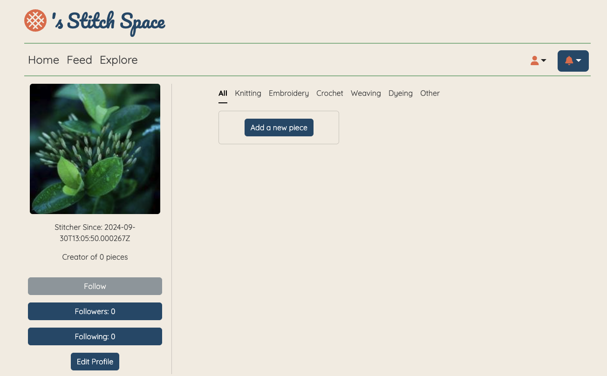
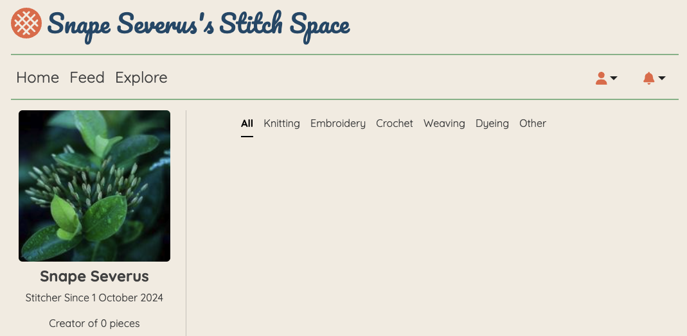

# Stitch Space: a fibre art portfolio social site 
This repository contains the back-end API for the Stitch Space website. The front-end repository can be found [here](https://github.com/EvitaKnits/stitch-space). The back-end API is built using Django, Django REST Framework, Python, and PostgreSQL, and is hosted on Heroku.

This README focuses exclusively on the back-end components and functionality within this repository. For information on the front end, including competitor analysis, development management with GitHub Projects, and Agile methodology, please refer to the README in the front-end repository.

To visit the deployed Stitch Space site [click here](https://stitch-space-f65c363b25bd.herokuapp.com/)

# Table of Contents
1. [Purpose](#1-purpose)
2. [Database Schema](#2-database-schema) 
    - [Data Validation](#data-validation)
    - [Development Notes](#development-notes)
3. [Endpoints and HTTP Requests](#3-endpoints-and-http-requests)
    - [Endpoints Overview](#endpoints-overview)
    - [Filtering and Search Options](#filtering-and-search-options)
    - [Pagination](#pagination)
4. [Testing](#4-testing)
    - [Continuous Manual Testing](#continuous-manual-testing) 
    - [Code Validation](#code-validation)
5. [Bugs](#5-bugs)
6. [Set Up and Deployment](#6-set-up-and-deployment)
7. [Credits](#7-credits)

## 1. Purpose
The goal of this API is to provide the required data to the front-end application to power Stitch Space: the dedicated space for fibre artists to showcase their portfolios.

## 2. Database Schema

I constructed this Entity Relationship Diagram prior to starting my project, to ensure the key entities and relationships were defined in Stitch Space.


Not shown in the diagram is that I will set two unique constraints to ensure: 

- A user can only follow another user once
- A user can only rate a piece once

### Data validation 

Data validation rules ensure the accuracy and reliability of information stored in the system, ensuring all entries adhere to expected formats. Below, I have detailed the requirements either defined in my models, required by my forms or as they stand in the Abstract User model inherited from Django:

**users**

- user_id: must be a unique integer (auto-assigned by Django)
- first_name: must be a non-empty string (max-length 150 characters)
- last_name: must be a non-empty string (max-length 150 characters)
- email: must be a valid email format and unique within the system
- password: Must meet validity requirements set out by Django's built-in password validators, quoted below [from the source](https://docs.djangoproject.com/en/5.0/topics/auth/passwords/#using-built-in-validators).
    - UserAttributeSimilarityValidator, which checks the similarity between the password and a set of attributes of the user.
    - MinimumLengthValidator, which checks whether the password meets a minimum length. This validator is configured with a custom option: it now requires the minimum length to be nine characters, instead of the default eight.
    - CommonPasswordValidator, which checks whether the password occurs in a list of common passwords. By default, it compares to an included list of 20,000 common passwords.
    - NumericPasswordValidator, which checks whether the password isn’t entirely numeric.
- image: must be a valid URL (max-length 1024 characters)
- biography: an optional text field
- art_type: must be one of the predefined types (knitting, crochet, embroidery, weaving, dyeing, other)
- last_visited_notifications: Datetime that may be empty (until first value is added)§
- created_at: Datetime assigned on creation of user instance
- updated_at: Datetime that may be empty (until first update is carried out)

**pieces**

- piece_id: must be a unique integer (auto-assigned by Django)
- title: must be a non-empty string (max-length 150 characters)
- image: must be a valid URL (max-length 1024 characters)
- user_id: must be an existing user_id
- art_type: must be one of the predefined types (knitting, crochet, embroidery, weaving, dyeing, other)
- created_at: Datetime assigned on creation of piece instance
- updated_at: Datetime that may be empty (until first update is carried out)

**comments**

- comment_id: must be a unique integer (auto-assigned by Django)
- content: a mandatory text field
- piece_id: must be an existing piece_id
- user_id: must be an existing user_id
- created_at: Datetime assigned on creation of comment instance
- updated_at: Datetime that may be empty (until first update is carried out)

**ratings**

- rating_id: must be a unique integer (auto-assigned by Django)
- user_id: must be an existing user_id
- piece_id: must be an existing piece_id
- score: must be an integer between 1 and 5
- created_at: Datetime assigned on creation of rating instance
- updated_at: Datetime that may be empty (until first update is carried out)

**followers**

- follower_id: must be a unique integer (auto-assigned by Django)
- user_id: must be an existing user_id
- follower_id: must be an existing follower_id
- created_at: Datetime assigned on creation of follower instance
- updated_at: Datetime that may be empty (until first update is carried out)

**notifications**

- notification_id: must be a unique integer (auto-assigned by Django)
- piece_id: optional - used only for comments and ratings
- actor_id: must be an existing user_id
- recipient_id: must be an existing user_id
- interaction_type: must be one of the predefined types (comment, rating, follow)
- created_at: Datetime assigned on creation of notification instance

### Development Notes
During implementation, I made some tweaks to my planned models to ensure maximum code readability and to follow convention I'd not previously known, where relevant. 
- It is not best practice to use '_id' suffixes on foreign keys, so these were removed.
- It is clearer to call the user that has been followed 'followed_user' rather than just 'user' so I changed this in the Followers table.
- As Django had an in-built `Users` model already which was being used by `dj_rest_auth` I decided to rename my "Users" model to "Profiles" during development.

I also needed to add/remove some fields:
- **Users**: 
    - I found that 'username' is a required field when extending Django's AbstractUser model. I didn't want to use the AbstractBaseUser so decided to implement a username after all but use the `email` field to populate it.
    - The 'art_type' field wasn't actually powering any functionality so was not implemented because it was redundant.
- **Pieces**: I added 'featured' to this model to enable me to mark certain pieces as featured to go on the home page of the site.
- **Comments**: I didn't need the 'updated_at' field in this model because I don't allow users to edit their comments.
- **Followers**: Again, the 'updated_at' field wasn't needed in this model because a user either followed a user or they didn't. Therefore either the row in the table existed or was deleted. There was nothing to update.

## 3. Endpoints and HTTP Requests 

This section outlines the key API endpoints for the application, detailing the HTTP methods, authentication and authorization requirements, as well as descriptions for each operation. These endpoints allow interaction with core features, such as user management, profiles, pieces, comments, and ratings. All endpoints are designed to follow RESTful principles, making them intuitive and easy to work with in client applications.

### Endpoints Overview

The table below provides an overview of the available endpoints, the supported HTTP methods, and the associated authentication or authorization requirements:

| Endpoint                                | Allowed Methods           | Authentication/Authorization      | Description                                |
|-----------------------------------------|---------------------------|-----------------------------------|--------------------------------------------|
| `dj-rest-auth/login`                    | POST                      | No authentication required        | User login                                 |
| `dj-rest-auth/logout`                   | POST                      | No authentication required        | User logout                                |
| `dj-rest-auth/registration/`            | POST                      | No authentication required        | User registration                          |
| `profiles/`                             | GET                       | No authentication required        | List all profiles                          |
| `profile/<int:id>/`                     | GET, PATCH, PUT, DELETE   | Requires authentication           | Retrieve, update, or delete a profile by ID |
| `profile/<int:id>/followers/`           | GET                       | No authentication required        | List followers for a profile               |
| `profile/<int:id>/followers/add/`       | POST                      | Users cannot follow themselves    | Add a follower to a profile                |
| `profile/<int:id>/followers/remove/`    | DELETE                    | Users can delete their own follows| Remove a follower from a profile           |
| `profile/<int:id>/following/`           | GET                       | No authentication required        | List profiles the user is following        |
| `profile/<int:id>/notifications/`       | GET                       | No authentication required        | List notifications for a profile           |
| `pieces/`                               | GET                       | No authentication required        | List all pieces                            |
| `pieces/create/`                        | POST                      | Requires authentication           | Create a new piece                         |
| `pieces/feed/`                          | GET                       | No authentication required        | List pieces of profiles the logged in user is following |
| `pieces/<int:id>/`                      | GET, PATCH, PUT, DELETE   | Requires authentication           | Retrieve, update, or delete a piece by ID  |
| `pieces/<int:id>/comments/`             | GET, POST                 | Requires authentication, read access allowed for all users | List or create comments on a piece         |
| `ratings/`                              | GET                       | No authentication required        | List all ratings                           |
| `ratings/<int:id>/`                     | GET, PATCH, PUT, DELETE   | Requires authentication, read access allowed for all users | Retrieve, update, or delete a rating by ID |
| `pieces/<int:id>/ratings/`              | GET, POST                 | Requires authentication, read access allowed for all users | List or create ratings for a piece         |

---

### Filtering and Search Options
To enhance the flexibility of the API, several endpoints provide options for filtering and sorting results. This allows the frontend to tailor its requests to specific needs, retrieving only the most relevant data. The table below outlines the filtering and search capabilities of the key endpoints:

| Endpoint                                | Filtering Options                                       | Search Options                                    |
|-----------------------------------------|---------------------------------------------------------|---------------------------------------------------|
| `dj-rest-auth/login`                    | None                                                    | None                                              |
| `dj-rest-auth/logout`                   | None                                                    | None                                              |
| `dj-rest-auth/registration/`            | None                                                    | None                                              |
| `profiles/`                             | Sort profiles by any field, defaults to sorting by ID   | None                                              |
| `profile/<int:id>/`                     | None                                                    | None                                              |
| `profile/<int:id>/followers/`           | Filter by follower's profile ID, sort by any field      | None                                              |
| `profile/<int:id>/followers/add/`       | None                                                    | None                                              |
| `profile/<int:id>/followers/remove/`    | None                                                    | None                                              |
| `profile/<int:id>/following/`           | Sort by any field, defaults to sorting by ID            | None                                              |
| `profile/<int:id>/notifications/`       | None                                                    | None                                              |
| `pieces/`                               | Filter by type of art, owner’s profile ID, or featured  | Search by title, owner's first name or last name  |
| `pieces/create/`                        | None                                                    | None                                              |
| `pieces/feed/`                          | None                                                    | None                                              |
| `pieces/<int:id>/`                      | None                                                    | None                                              |
| `pieces/<int:id>/comments/`             | Sort comments by creation date                          | None                                              |
| `ratings/`                              | Filter by piece or profile                              | None                                              |
| `ratings/<int:id>/`                     | None                                                    | None                                              |
| `pieces/<int:id>/ratings/`              | Filter by profile owner ID                              | None                                              |

#### Pagination 
To handle larger datasets and ensure good performance, all list-based endpoints utilise pagination. This structure helps limit the number of results returned in a single response. The following structure describes the pagination response format: 

```javascript
{
    "count": 64, // Total number of objects in the database
    "nextPage": 2, // Page number of the previous page of results
    "previousPage": 4, // Page number of the previous page of results
    "results": [{}] // The objects on this page (e.g page 3)
}
```

---

## 4. Testing

### Continuous Manual Testing

Through continuous manual testing from the front-end, combined with checks via the 'Admin' panel and hitting the Django Rest Framework interface to examine the JSON responses on various endpoiunts, I achieved a good coverage of test cases. The code I wrote was also passed through validators/linters at the end to ensure adherence to coding standards and best practices, ultimately aiming for robust and maintainable code.

### Code Validation

| Language   | Validation Method | Outcome |
| --- | --- | --- |
| Python | [CI Python Linter](https://pep8ci.herokuapp.com/) | Whitespace, line length and number of blank line errors. All errors resolved |

## 5. Bugs

The majority of the bugs found were on the front end repository, and ten of them have been detailed there. I have included an example of a bug found here in the back-end repository below: 

### Bug One

Issue: Registering a new user doesn't assign their first name and last name correctly to the database, thus their Stitch Space is not populated correctly on the front end.



Fix: I found the solution [here](https://stackoverflow.com/questions/62291394/django-rest-auth-dj-rest-auth-custom-user-registration). The first_name and last_name fields were not being properly assigned during user registration so I needed to add the registration serializer and customise it to include these fields and ensure they were correctly saved to the database upon user creation. 

 

## 6. Set Up and Deployment

### Django Rest Framework Backend Set Up

1. Set Environment Variables
    Defined and set the necessary environment variables in my project to confugure the backend with external services and security settings: 
    - CLIENT_ORIGIN: set this to the URL of the frontend app that will be making requests to the backend.
    - DATABASE_URL: specified the PostgreSQL database connection string. 
    - DISABLE_COLLECTSTATIC: set this to '1' to skip static file collection during deployment, used for Heroku deployments. 
    - SECRET_KEY: defined a secret key for Django's security features.

2. Installed Libraries for Database Connection
    Installed the necessary libraries to handle the database connection and configuration: 
    - psycopg2: PostgreSQL adapter for Python to allow Django to interact with a PostgreSQL database.
    - dj-database-url: simplifies the database configuration by allowing the use of a single DATABASE_URL environment variable. 

3. Configured dj-rest-auth for JWT Authentication
    Set up dj-rest-auth to handle JSON Web Token (JWT) authentication for the API. This involved updating the Django settings file to use dj-rest-auth as the authentication system.
    - Updated INSTALLED_APPS with dj_rest_auth and rest_framework.
    - Set JWT-specific settings in the settings.py file for token handling. 

4. Set Allowed Hosts
    Configured ALLOWED_HOSTS in the settings.py file to ensure that only trusted domains can access the backend. I added the domain of the deployed app and any relevant subdomains. 

5. Configured CORS
    Set up Cross-Origin Resource Sharing (CORS) to control which origins are permitted to interact with the API. Installed and configured the django-cors-headers library. 

6. Set Default Renderer to JSON
    Configured the default renderer in the Django REST framework to JSON to ensure API responses are sent in the correct format. 

7. Added a Procfile for Heroku Deployment
    Created a Procfile in the root directory of the project to instruct Heroku on how to run the application. This includes commands for running the web server and managing database migrations. 

8. Ignored env.py
    For security purposes, I created an env.py file to store environment variables locally and added it to .gitignore to ensure it is not tracked by version control.

9. Generated requirements.txt
    Created a requirements.txt file via pip, which lists all the Python dependencies needed to run the project. 

### Running Locally
- Install Python and PostgreSQL
- Set up a virtual environment and install the dependencies with `pip install -r requirements.txt`
- Apply DB Migrations with `python manage.py migrate`
- Run the development server with `python manage.py runserver`

### Deployment

This project was deployed to [Heroku](https://id.heroku.com/login): a hosting platform.

## 7. Credits

I referred to the Code Institute material on Django Rest Framework and related concepts.

- I built my flowcharts using [Mermaid](https://mermaid.js.org/syntax/flowchart.html) in my readme.
- I used [ChatGPT](https://chatgpt.com) to explain error messages and research the best way to go about my implementation.
- I found my Django settings configuration for JWT cookies in [this article](https://medium.com/@michal.drozdze/django-rest-apis-with-jwt-authentication-using-dj-rest-auth-781a536dfb49#:~:text=If%20you%20need%20to%20refresh,%2Ftoken%2Frefresh%2F%20endpoint.)

I also used the documentation of all the elements included in this project: 
- [Django](https://docs.djangoproject.com/en/4.2/)
- [Django REST Framework](https://www.django-rest-framework.org/)
- [PostgreSQL](https://www.postgresql.org/docs/current/)

### General Credit
As ever, I want to thank the open source community for the great resources that teach me so much and also remind me of what I learnt in my Code Institute lessons. 

I believe I have credited where I used specific items in the previous section but this is a general credit to the reference resources I looked through to teach me new elements as well as reminding me how things I'd already come across worked as I went along. 

Every effort has been made to credit everything used, but if I find anything else specific later on that needs crediting, that I missed, I will be sure to add it.

